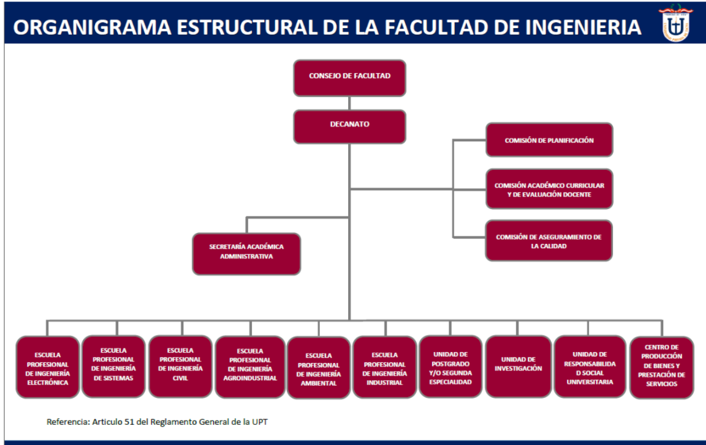

[comment]: 

**UNIVERSIDAD PRIVADA DE TACNA**

**FACULTAD DE INGENIERIA**

**Escuela Profesional de Ingeniería de Sistemas**

**Proyecto *"Infraestructura Tecnológica para el Evento Juegos Florales de la Universidad Privada de Tacna"***

Curso: *Tópicos de Base de Datos Avanzados*

Docente: *Mag. Patrick Cuadros Quiroga*

Integrantes:

***Apaza Ccalle, Albert Kenyi (2021071075)***

***Huallpa Maron, Jesús Antonio (2021071085)***

**Tacna – Perú**

***2024***

**  
**

<table style="width: 100%; border: none;">
<tr>
    <td style="text-align: left; vertical-align: top;">
        
    </td>
    <td style="text-align: right; vertical-align: top;">
        
    </td>
</tr>
</table>

\pagebreak

|CONTROL DE VERSIONES||||||
| :-: | :- | :- | :- | :- | :- |
|Versión|Hecha por|Revisada por|Aprobada por|Fecha|Motivo|
|1\.0|MPV|ELV|ARV|10/10/2020|Versión Original|

**Sistema *"Infraestructura Tecnológica para el Evento Juegos Florales de la Universidad Privada de Tacna"***

**Documento de Especificación de Requerimientos de Software**

**Versión *{1.0}***
**

\pagebreak

|CONTROL DE VERSIONES||||||
| :-: | :- | :- | :- | :- | :- |
|Versión|Hecha por|Revisada por|Aprobada por|Fecha|Motivo|
|1\.0|MPV|ELV|ARV|10/10/2020|Versión Original|

\pagebreak

**INDICE GENERAL**
#
[1.	Generalidades de la Empresa](#_Toc52661346)

1.1	Nombre de la Empresa

1.2	Vision

1.3	Mision

1.4	Organigrama

[2.	Visionamiento de la Empresa](#_Toc52661347)

2.1	Descripción del Problema

2.2	Objetivos de Negocios

2.3	Objetivos de Diseño

2.4	Alcance del proyecto

2.5	Viabilidad del Sistema

2.6	Información obtenida del Levantamiento de Información

[3.	Análisis de Procesos](#_Toc52661348)

3.1	Diagrama del Proceso Actual – Diagrama de actividades

3.2	Diagrama del Proceso Propuesto – Diagrama de actividades Inicial

[4.	Especificación de Requerimientos de Software](#_Toc52661349)

4.1	Cuadro de Requerimientos funcionales Inicial

4.2	Cuadro de Requerimientos No funcionales

4.3	Cuadro de Requerimientos funcionales Final

4.4	Reglas de Negocio

[5.	Fase de Desarrollo](#_Toc52661350)

5.1	Cuadro de Requerimientos funcionales Inicial

5.2	Cuadro de Requerimientos No funcionales

- **a)** Diagrama de Paquetes
- **b)** Diagrama de Casos de Uso
- **c)** Escenarios de Caso de Uso (narrativa)

5.3	Cuadro de Requerimientos funcionales Final

- **a)** Análisis de Objetos
- **b)** Diagrama de Actividades con Objetos
- **c)** Diagrama de Secuencia
- **d)** Diagrama de Clases

[CONCLUSIONES](#_Toc52661355)

[RECOMENDACIONES](#_Toc52661356)

[BIBLIOGRAFIA](#_Toc52661357)

[WEBGRAFIA](#_Toc52661358)

\pagebreak

**<u>Informe Especificacion Requerimientos</u>**

    El presente documento describe los requerimientos de infraestructura tecnológica para el proyecto "Infraestructura Tecnológica para el Evento Juegos Florales de la Universidad Privada de Tacna". El objetivo principal de este proyecto es diseñar y desplegar una infraestructura robusta y escalable que permita la correcta ejecución de las actividades del evento Juegos Florales, utilizando tecnologías de vanguardia.

    Este proyecto se enfoca en la creación de una infraestructura tecnológica que optimice la gestión del evento mediante el uso de servicios en la nube, como AWS (Amazon Web Services), y herramientas especializadas para la automatización, monitoreo y gestión de datos. El uso de plataformas como Terraform, MongoDB Atlas y Grafana contribuirá a mejorar la disponibilidad, seguridad y eficiencia de la infraestructura necesaria para soportar los requerimientos del evento, proporcionando un entorno ágil y confiable.

    El documento tiene como propósito definir y detallar los requerimientos técnicos de la infraestructura del sistema, estableciendo claramente los recursos y servicios que serán necesarios para el funcionamiento eficiente y seguro del evento. Además, aborda las características y condiciones de la infraestructura que deben cumplir para satisfacer las necesidades de los usuarios, alineando las expectativas del equipo de desarrollo, los organizadores del evento y los involucrados en la toma de decisiones.

1. **Generalidades de la Empresa**

    1.1	Nombre de la Empresa

        Universidad Privada de Tacna

    1.2	Visión

        La visión de la Universidad Privada de Tacna es ser una universidad líder en el sur del Perú, comprometida con la innovación tecnológica y el desarrollo académico. A través de la incorporación de tecnologías avanzadas, busca mejorar la experiencia de sus estudiantes y fortalecer su posición en el ámbito educativo regional y nacional.

    1.3	Misión

        La misión de la Universidad Privada de Tacna es formar profesionales altamente capacitados en diversas especialidades, promoviendo la investigación, la innovación y la calidad educativa. Se enfoca en ofrecer una formación integral que prepare a sus estudiantes para enfrentar los desafíos del mundo laboral globalizado, a través del uso de tecnologías de vanguardia.

    1.4	Organigrama

    

\pagebreak

2. **Visionamiento de la Empresa**

    2.1 Descripción del Problema

        La gestión del evento Juegos Florales de la Universidad Privada de Tacna enfrenta diversos problemas logísticos y tecnológicos que impactan directamente en la organización y la experiencia de los participantes:

        Falta de infraestructura tecnológica eficiente: Actualmente, el evento no cuenta con un sistema centralizado para gestionar las actividades, los registros de los participantes ni la administración de los recursos durante el evento. Esto genera dificultades en la coordinación de las diferentes áreas involucradas, lo que puede llevar a retrasos y errores en la ejecución de las actividades.

        Falta de escalabilidad y flexibilidad: La infraestructura actual no está diseñada para soportar un número creciente de usuarios o la cantidad de datos generados durante el evento. En eventos de gran escala, como los Juegos Florales, esto puede generar problemas de rendimiento, saturación de servidores y caídas del sistema, lo que afecta la disponibilidad y la experiencia de los participantes.

        Monitoreo inadecuado del rendimiento: No existe una plataforma de monitoreo que permita supervisar en tiempo real el estado de los servicios tecnológicos, lo que dificulta la identificación rápida de problemas. Esto lleva a que cualquier falla o incidente se detecte tarde, lo que aumenta los tiempos de respuesta y puede afectar la continuidad del evento.

        Dificultades en la administración de los datos: La gestión de la información generada durante el evento, como las inscripciones, los resultados y las interacciones de los participantes, es manual y dispersa. Esto no solo aumenta el riesgo de errores, sino que también dificulta la toma de decisiones en tiempo real debido a la falta de una base de datos centralizada y actualizada.

        Riesgos de seguridad: La infraestructura actual no cuenta con medidas de seguridad avanzadas, lo que pone en riesgo la integridad de los datos personales de los participantes y la estabilidad de los sistemas utilizados durante el evento. La falta de políticas de seguridad adecuadas también podría exponer la infraestructura a amenazas cibernéticas.

    2.2 Objetivos de Negocios

        Optimizar la gestión del evento: Mejorar la eficiencia operativa mediante la automatización de procesos, como el registro de participantes, la asignación de recursos y la gestión de actividades, reduciendo el tiempo y esfuerzo dedicados a tareas manuales y aumentando la productividad.

        Asegurar la escalabilidad del sistema: Implementar una infraestructura tecnológica que pueda adaptarse al crecimiento del número de usuarios, participantes y datos generados durante el evento, garantizando una experiencia fluida sin interrupciones ni caídas del sistema.

        Monitorear el rendimiento en tiempo real: Establecer un sistema de monitoreo en tiempo real para supervisar la disponibilidad y el estado de los servicios y aplicaciones utilizadas en el evento, permitiendo detectar y resolver problemas antes de que afecten la experiencia de los participantes.

        Mejorar la seguridad de la infraestructura: Implementar medidas de seguridad robustas para proteger los datos de los participantes y la integridad de los sistemas, reduciendo riesgos de pérdida de información o ciberataques durante el evento.

        Reducir costos operativos: Minimizar los costos asociados con la gestión manual y las intervenciones reactivas mediante la automatización, optimización de recursos y el uso de soluciones tecnológicas que permitan un mantenimiento preventivo y una mayor eficiencia operativa.

        Fortalecer la experiencia de los participantes: Garantizar una plataforma accesible, ágil y sin interrupciones para los asistentes y organizadores del evento, mejorando la interacción de los usuarios y asegurando una experiencia más satisfactoria y profesional.

    2.3 Objetivos de Diseño

        Automatización de procesos: Diseñar un sistema que permita la automatización de tareas críticas como el registro de participantes, la asignación de recursos, y la actualización de información durante el evento. Esto garantizará una ejecución más eficiente, reduciendo errores humanos y mejorando la rapidez de la toma de decisiones.

        Interfaz intuitiva y fácil de usar: Crear una interfaz de usuario sencilla, interactiva e intuitiva que permita a los organizadores y participantes interactuar con el sistema de manera eficiente, sin necesidad de contar con conocimientos técnicos avanzados, mejorando la experiencia de usuario.

        Monitoreo y visualización en tiempo real: Incorporar herramientas de visualización que permitan a los organizadores y administradores monitorear el estado del evento en tiempo real, desde el registro de participantes hasta el rendimiento de las aplicaciones utilizadas, facilitando la toma de decisiones rápidas ante cualquier inconveniente.

        Escalabilidad y flexibilidad del sistema: Diseñar una infraestructura que sea capaz de adaptarse a cambios inesperados en la cantidad de usuarios o en la cantidad de datos procesados durante el evento, permitiendo que el sistema se expanda o reduzca según sea necesario sin comprometer el rendimiento.

        Seguridad y protección de datos: Implementar medidas de seguridad avanzadas en el diseño del sistema para proteger la información personal de los participantes y asegurar la integridad de los datos gestionados durante el evento, garantizando el cumplimiento de normativas de privacidad y seguridad.

        Accesibilidad y disponibilidad: Asegurar que el sistema sea accesible desde cualquier dispositivo conectado a Internet y que funcione sin interrupciones, permitiendo a los organizadores y participantes acceder a la plataforma en cualquier momento y desde cualquier lugar, garantizando la disponibilidad de los servicios durante todo el evento.

    2.4 Alcance del proyecto

        Inclusiones:

            Automatización de registros y gestión de participantes: El sistema incluirá la automatización del proceso de inscripción de los participantes en el evento, así como la gestión de la información personal, asegurando que los datos sean procesados de manera eficiente y sin errores manuales. También permitirá la actualización en tiempo real de los registros.

            Monitoreo en tiempo real del evento: Se implementará un sistema de monitoreo en tiempo real que rastreará el estado de las aplicaciones utilizadas en el evento, incluyendo plataformas de registro, acceso de los participantes y las herramientas de evaluación. Esto garantizará que cualquier fallo o inconveniente pueda ser detectado y solucionado de manera proactiva antes de que afecte el desarrollo del evento.

            Dashboard interactivo para organizadores: El sistema incluirá un dashboard interactivo y fácil de usar que permitirá a los organizadores visualizar el estado general del evento, incluyendo el número de participantes registrados, el rendimiento de las aplicaciones y los recursos utilizados. Este dashboard permitirá tomar decisiones rápidas basadas en datos en tiempo real.

            Generación de reportes detallados y exportables: Se habilitará una funcionalidad que permita generar reportes detallados sobre el evento, que incluirán métricas clave, como la cantidad de participantes, el uso de recursos, las incidencias registradas y otros aspectos importantes. Estos reportes podrán ser exportados en formatos estándar como PDF o Excel para su análisis y archivo.

            Escalabilidad y flexibilidad en la infraestructura: El sistema se diseñará de manera que pueda escalar según el número de participantes y la carga de trabajo durante el evento, garantizando que se mantenga el rendimiento adecuado incluso en momentos de alta demanda.

        Exclusiones:

            Gestión de eventos fuera del ámbito de los Juegos Florales: El sistema no se extenderá a la gestión de otros eventos organizados por la universidad, ni gestionará eventos fuera del marco del Juegos Florales, como actividades académicas o administrativas.

            Soporte de plataformas de comunicación externas: El sistema no incluirá soporte para plataformas de comunicación externa como correo electrónico, mensajería o redes sociales, ya que estos canales estarán gestionados por otros sistemas y no son parte de la infraestructura del evento.

            Gestión de equipos tecnológicos no asociados al evento: El proyecto se centrará exclusivamente en la infraestructura tecnológica utilizada para la organización del evento Juegos Florales, por lo que no se incluirán la gestión ni el monitoreo de equipos fuera de este contexto (por ejemplo, equipos de la universidad no involucrados directamente en el evento).

    2.5 Viabilidad del Sistema

    ##### 2.5.1. Viabilidad Técnica

        Hardware Disponible

            Equipos de desarrollo: Se dispone de los equipos necesarios para el desarrollo y pruebas del sistema de infraestructura tecnológica. Los requisitos técnicos básicos incluyen:
                Procesador: Intel Core i5 o superior, que garantiza un rendimiento adecuado para ejecutar las herramientas de desarrollo y las aplicaciones necesarias.
                Memoria RAM: Entre 8 GB y 16 GB DDR4, suficiente para realizar múltiples tareas y mantener una respuesta rápida en las aplicaciones.
                Almacenamiento: Disco SSD con capacidad mínima de 256 GB, para asegurar tiempos de carga rápidos y una mayor durabilidad en los equipos utilizados.
                Conectividad: Equipos con acceso a internet de alta velocidad para asegurar la carga y el acceso a los servicios en la nube sin interrupciones.

        Software Disponible

            Plataformas en la nube y herramientas de desarrollo:
                AWS (Amazon Web Services): Utilización de AWS para el alojamiento de la infraestructura del evento, con servicios como EC2 para servidores virtuales, S3 para almacenamiento y RDS para bases de datos, permitiendo una implementación escalable y eficiente.
                Terraform: Herramienta para automatizar la infraestructura como código (IaC), que garantiza una configuración coherente y repetible del entorno, permitiendo la creación, modificación y destrucción de recursos de manera eficiente.
                MongoDB Atlas: Plataforma para bases de datos en la nube que se utilizará para almacenar los datos relacionados con los registros de los participantes y las actividades del evento, garantizando escalabilidad y disponibilidad.
                Grafana: Herramienta de monitoreo y visualización que permitirá el análisis en tiempo real del estado de las aplicaciones y sistemas utilizados durante el evento, con la capacidad de generar dashboards personalizables.

        Infraestructura de Red

            Conectividad confiable: Se requiere una conexión a Internet estable y de alta velocidad para la gestión de la infraestructura en la nube, asegurando que todas las aplicaciones funcionen de manera continua y sin interrupciones durante el evento.
            Red de alta capacidad: Equipos de red como switches y routers de última generación serán utilizados para garantizar un flujo de datos eficiente y sin cuellos de botella, incluso con un gran volumen de usuarios conectados simultáneamente.

        Automatización y Configuración

            Automatización con Terraform: El uso de Terraform permitirá gestionar el entorno de infraestructura como código (IaC), haciendo posible la configuración automatizada de recursos en AWS y evitando errores humanos. Esto también acelera el proceso de despliegue, ya que se puede replicar el mismo entorno en diferentes fases del proyecto (desarrollo, pruebas y producción).
            Automatización de procesos con Python y HCL2: Se utilizarán scripts escritos en Python y HCL2 para automatizar tareas específicas dentro de la infraestructura, como la configuración de recursos en la nube y la recolección de métricas de rendimiento. Esto permitirá la gestión eficiente de la infraestructura sin intervención manual constante, optimizando los tiempos de respuesta y reduciendo el riesgo de errores.

    ##### 5.2. Viabilidad Económica

        El análisis de costos totaliza los recursos necesarios para el desarrollo e implementación del sistema, considerando los siguientes conceptos:

        | **Concepto** | **Costo Total (S/.)** |
        |--------------|-----------------------|
        | **Costos Generales** | 3,222.00 |
        | **Costos Operativos durante el Desarrollo** | 500.00 |
        | **Costos del Ambiente** | 450.00 |
        | **Costos del Personal** | 6,000.00 |
        | **Total** | 10,172.00 |

        Este presupuesto permite cubrir todos los aspectos esenciales del proyecto, asegurando una relación costo-beneficio favorable y sostenibilidad a largo plazo.

    ##### 5.3. Viabilidad Operativa

        Optimización de Recursos: El sistema propuesto permitirá a la universidad maximizar la utilización de la infraestructura tecnológica disponible, proporcionando información detallada sobre el desempeño y el uso de recursos clave, como el servidor, bases de datos, y el tráfico de red. Esta visibilidad permitirá una planificación más precisa del mantenimiento y la redistribución de los recursos, asegurando que se utilicen de manera eficiente durante el evento.

        Mejora en la Toma de Decisiones: Al ofrecer datos en tiempo real sobre el rendimiento de los sistemas, la plataforma facilitará a los administradores del evento tomar decisiones informadas. Esto incluye la gestión del ancho de banda, la asignación de recursos según las necesidades del evento y la prevención de posibles cuellos de botella o fallos. La disponibilidad de información precisa permitirá a los responsables adaptarse rápidamente a cualquier cambio en las condiciones operativas.

        Facilidad de Uso e Integración: El sistema se diseñará con una interfaz fácil de usar que requerirá una mínima curva de aprendizaje para el personal técnico y organizador. Además, la solución será compatible con las plataformas tecnológicas existentes de la universidad, garantizando que la implementación no interrumpa las operaciones cotidianas. Su capacidad de integración asegurará que el sistema funcione sin problemas dentro del entorno tecnológico actual, lo que facilitará su adopción y uso por parte de los administradores y técnicos.

    2.6 Información obtenida del Levantamiento de Información

        Durante el levantamiento de información para el desarrollo del sistema, se identificaron los siguientes aspectos clave:

    **Necesidades de los Técnicos de Soporte:**

        - Requieren una herramienta centralizada para monitorear el estado de la red en tiempo real, con alertas automáticas que les permitan identificar problemas antes de que afecten a los usuarios.

    **Requerimientos de los Administradores:**

        - Necesitan reportes claros y personalizados sobre el rendimiento de la red para tomar decisiones informadas y planificar mantenimientos o actualizaciones futuras.

        Esta información valida la necesidad del sistema como una solución integral para optimizar el rendimiento y la gestión de la red en los laboratorios de la universidad.

\pagebreak

3. **Análisis de Procesos**

    3.1 Diagrama del Proceso Actual – Diagrama de actividades

    

    3.2 Diagrama del Proceso Propuesto – Diagrama de actividades Inicial

    

\pagebreak

4. **Especificación de Requerimientos de Software**

    4.1 Cuadro de Requerimientos funcionales Inicial

    4.2 Cuadro de Requerimientos No funcionales

    4.3 Cuadro de Requerimientos funcionales Final

    4.4 Reglas de Negocio

\pagebreak

5. **Cuadro de Requerimientos funcionales Inicial**

    5.1 Cuadro de Requerimientos funcionales Inicial

    5.2	Cuadro de Requerimientos No funcionales

    - **a)** Diagrama de Paquetes

    - **b)** Diagrama de Casos de Uso

    - **c)** Escenarios de Caso de Uso (narrativa)

    5.3	Cuadro de Requerimientos funcionales Final

    - **a)** Análisis de Objetos

    - **b)** Diagrama de Actividades con Objetos

    - **c)** Diagrama de Secuencia

    - **d)** Diagrama de Clases

\pagebreak

**CONCLUSIONES**

\pagebreak

**RECOMENDACIONES**

\pagebreak

**BIBLIOGRAFIA**

\pagebreak

**WEBGRAFIA**

\pagebreak

